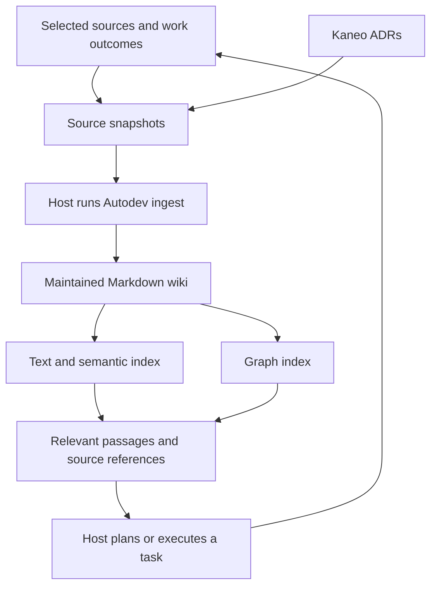

# LLM Wiki and retrieval

Implementation proposal, 2026-09-07. Architecture decisions and their review state belong in Kaneo. This document specifies the resulting storage and tool contracts; it does not replace the currently approved [Project Overview](project-overview.md), execution policy, or task source.

- [AUT-1: Adopt LLM Wiki maintenance](https://kaneo.local/dashboard/workspace/ZQYlQlH6msK68Hh0DowBkKYAKVPQxilz/project/nw3nsey0mz2lkb0rgtzms8dy/task/aubzawkgzopv4mstxn2kyn3y)
- [AUT-2: Derive retrieval indexes from the wiki](https://kaneo.local/dashboard/workspace/ZQYlQlH6msK68Hh0DowBkKYAKVPQxilz/project/nw3nsey0mz2lkb0rgtzms8dy/task/lf24nbrx8cvpbmgyzwgkihkb)

## Product boundary

Autodev maintains a reusable, source-backed wiki from selected material and actual work. Before a task, it retrieves applicable knowledge with its evidence and limitations. After a task, correction, or new source, it updates the wiki so the next task can use what was learned.

| Owner | Responsibility |
| --- | --- |
| Agent Host | Model loop, context management, tools, permissions, code changes, tests, and recovery during execution |
| Autodev Skill | Source selection, wiki integration, applicability judgment, contradiction handling, and retrieval guidance |
| Private Knowledge repository | Source snapshots, maintained Markdown, explicit relationships, reusable assets, and Git history |
| Search and graph tools | Rebuildable indexes over a committed wiki revision |
| Kaneo | Project ADRs, decision discussion, acceptance, and supersession |
| Delivery adapter | Optional event-driven task execution and external write gates |

Knowledge ingestion and lookup must work without a task graph, GitHub issue, delivery configuration, or approval of a whole project. A wiki statement can inform work but cannot grant permissions or change a project's approved scope.



## Knowledge repository

Use the existing `dev-knowledge` repository, made private before private material is captured. Keep its existing templates and metadata where they already fit. The proposed layout is:

```text
dev-knowledge/
  index.md                 # Entry point; links to the wiki catalog
  raw/                     # Captured sources and work observations
  wiki/
    index.md               # Page links and short descriptions
    <topic>.md             # Maintained explanations and comparisons
  templates/               # Existing reusable assets
```

The raw layer preserves what a source said or what happened. It can contain incorrect or conflicting claims. The wiki records the current synthesis, with links back to that evidence. Search results and graph edges are derived data, never independent places to edit knowledge.

Keep database files, embeddings, engine logs, and index checkpoints outside Git in a local cache. Git records each coherent wiki update and its reason; a second chronological `log.md` is unnecessary initially. The wiki catalog contains navigation, not another copy of the knowledge.

### Sources

Capture only selected documents or useful observations, including failed approaches and user corrections. Preserve original bytes when practical; store extracted text alongside a binary when needed for ingestion. A changed external source creates a new snapshot rather than overwriting the earlier capture. An explicit removal request can remove a source and its derivatives.

Each capture has a stable source ID for that captured version, original URL or project artifact reference, capture time, and a revision identifier or content digest. Deduplicate by origin and content digest; a changed source gets a new capture ID. Store this metadata in Markdown frontmatter, or in an adjacent Markdown record for a binary asset. Cite a specific commit for repository evidence when available. Do not copy entire conversations or logs when a short factual observation and durable artifact reference suffice.

Kaneo decision snapshots additionally record the observed decision state and the source revision or content digest. They are historical evidence. Current project authority remains with the Kaneo record, not its captured copy.

### Wiki pages

Organize a page around a useful question, concept, or procedure. Integrate related evidence into that page rather than creating one lesson per task. Split a page only when its topics need separate retrieval or independently scoped relationships.

Reuse the existing `title`, `description`, `tags`, `status`, and `sources` conventions. Add a stable `id` that survives file moves. IDs are unique within the selected Knowledge repository; multi-repository search qualifies them with repository identity. Preserve existing asset links and descriptive metadata without requiring a new taxonomy.

The following is an illustrative page, not a record of an already accepted Kaneo decision:

```yaml
id: independent-issue-approval
type: Playbook
title: Approving independent GitHub issues
description: Separate task approval when issues can change independently.
tags: [github, issues, approval]
status: stable
sources:
  - id: approval-change
    resource: ../raw/issue-approval-change.md
relations:
  - type: supersedes
    target: rooted-issue-approval
    scope: Projects with independently authorized issues
    basis: "#independent-tasks"
```

The body explains applicability, the reasoning, exceptions, and unresolved questions where relevant. A significant claim cites the specific source and passage that supports it; a source list alone is insufficient. `basis` points to the passage explaining the relationship and citing its evidence.

`stable` means no known unresolved conflict in the main conclusion, not user approval or universal validity. Use `disputed` when that conclusion has conflicting evidence and `superseded` when the page's guidance has been fully replaced. Scoped exceptions and partial replacement stay explicit in the body and relation scope. Disputed and superseded pages remain searchable with their status attached.

Use `stale_after` only for claims whose usefulness depends on freshness. Passing a date or being marked stable does not establish applicability. Writing or re-indexing a page must never count as factual verification.

## Maintaining the wiki

The host runs three workflows through the portable Skill: ingest, query, and maintain. These are workflow boundaries, not a new agent runtime or three mandatory services.

### Ingest

1. Resolve the selected source and writable Knowledge target through the Host's existing authorization. Ordinary project execution keeps Knowledge read-only; maintenance receives a separate, explicitly selected write scope. Reuse that authorization while the target and scope remain unchanged.
2. Capture a novel source, or reuse the existing capture when identity and content digest match. Preserve observations from failures without changing their execution status to successful.
3. Read the wiki catalog and plausible matches. Compare new evidence with existing claims, scope, and unresolved contradictions.
4. Update affected pages, citations, and explicit relations as one coherent change. Create a page only when existing pages cannot accommodate the subject. Preserve competing evidence instead of silently choosing a winner.
5. Check source references, unique IDs, links, relation targets, and catalog entries. Review whether the actual source supports each changed claim. Deterministic checks cannot establish that semantic judgment.
6. Commit the source and wiki changes together, then refresh available derived indexes. An index failure leaves the valid commit intact and lookup falls back to files.

In the proposed maintenance policy, grounded synthesis, indexing, and link repair can proceed within delegated write scope without approval of every page. A newly inferred personal preference, an unresolved material choice, or a project decision is presented to the user; project ADRs are handled in Kaneo. Do not infer agreement from silence or treat an LLM-generated answer as independent evidence for itself.

Retries compare source identity and digest, then inspect the committed wiki before writing. Concurrent updates use separate Git branches. Re-read affected pages after merging or rebasing before resolving a content conflict; do not overwrite another maintainer's synthesis. No queue or daemon is required.

### Query

Start with the wiki. Locate candidate pages, read the relevant sections, and compare their conditions with the current task. Follow sources when verifying a claim, when evidence conflicts, or when the wiki lacks the requested detail. Raw-source results are labeled as source material, not maintained guidance.

Return the smallest useful passages with applicability, exceptions, status, and provenance. Record adopted or rejected Knowledge references in existing project evidence when they materially change a decision. Keep private references in the private Knowledge repository if project evidence is public.

A useful answer may improve the wiki when it adds supported synthesis. A query does not require a write, and prior generated answers never become new corroborating sources merely because they were saved.

### Maintain

Check changed pages and their neighbors for broken references, unsupported claims, contradictory guidance, obsolete assumptions, and missing connections. Reopen a dismissed candidate only when materially new evidence or scope justifies reconsideration.

Trigger maintenance after ingestion, on a directly observed contradiction, or on request. A scheduled freshness sweep can be added later. When a due fact affects a current task, verify it against current sources before relying on it; otherwise return its stale status without inventing an update.

## Retrieval

The Agent Host already provides file search, file reads, and context management, and the corpus starts near zero. Retrieval therefore begins with what exists: Host-native search over the wiki, the catalog for navigation, and front matter relations for link traversal. No separate search service is built or configured at this stage.

A derived index is added only when its promotion condition is met, and each miss that would justify one is recorded as a maintenance observation rather than remembered:

| Derived index | Promotion condition | First candidate |
| --- | --- | --- |
| Semantic search | File search misses accumulate in recorded lookups, including Korean queries for English material | [QMD](https://github.com/tobi/qmd), after checking Korean retrieval quality and local resource use |
| Graph queries | Multi-hop relation questions recur in real work and catalog delivery is insufficient | A local graph database over the front matter relations |

Every result must be traceable to the Knowledge repository, stable page ID, path, and section, with page status and source references attached. Host-native search takes this from the page and Git. Before a result informs work, re-read the current file and reject deleted targets.

## Graph projection

The first graph contains wiki pages and captured sources. Avoid extracting every noun into an entity or building an ontology before a real query needs it.

| Edge | Created from | Meaning |
| --- | --- | --- |
| `related_to` | Ordinary internal page links | The author connected the topics; no causal claim |
| `cites` | A page's source references | The page refers to this source; not necessarily agreement |
| `supports` | Explicit relation with a cited basis | Evidence supports a target conclusion within the stated scope |
| `contradicts` | Explicit relation with a cited basis | Claims conflict under the stated conditions |
| `supersedes` | Explicit relation with a cited basis | This guidance replaces the target within the stated scope |

Semantic relations require `type`, target page ID, scope, and a resolvable basis passage that cites evidence. An ordinary hyperlink must not be upgraded to `supports` or `supersedes`. Proposed relations stay with the proposed wiki change until committed; a committed relation remains a sourced interpretation, not a proof.

Keep direction as written. A `supersedes` edge points from new guidance to old guidance. Traversal may follow incoming or outgoing edges but returns their original meaning. Cycles are allowed for related or conflicting topics. Cyclic replacement claims are a maintenance finding and must not produce an automatic preferred answer.

Start relation queries from pages found by normal search. Default to one hop and a bounded result count; use two hops only when the question needs an intermediate relationship. Return paths and their evidence rather than concatenating every connected page into the prompt. Applicability remains a Host judgment informed by the edge scope.

Until the graph promotion condition is met, this projection exists only as front matter and links, traversed directly. Writing the relations now is what keeps the option open: a later graph is regenerated from committed Markdown without invoking an LLM to rediscover relationships, and an earlier incarnation showed why that rule matters when a derived index silently dropped from 42 edges to none while every canonical record stayed correct.

When a graph database is promoted, its build, refresh, and recovery contract is designed then, in its own decision record. Whatever is chosen, indexes and caches stay inside the same authorized data boundary: making a GitHub repository private does not configure a hosted search provider, so bindings run locally first.

## Kaneo decision records

Create project ADRs as Kaneo items in the selected autodev project. Use a clear `ADR:` title and a concise body containing context, the decision, meaningful alternatives, consequences, and verification. Record the decision state explicitly as proposed, accepted, or superseded, with the acceptance evidence and replacement link when applicable. A task being marked done does not by itself mean a decision was accepted.

Kaneo holds the discussion and current decision state. This repository holds the implementation-facing contract and links to those records. The LLM Wiki can capture a decision as evidence and generalize its reasoning, but does not become an editable mirror of the ADR or silently change its project-specific meaning.

Changes to an ingested Kaneo record create a new source snapshot and trigger review of pages citing the old snapshot. Re-read the current Kaneo record when a project decision materially affects work. If Kaneo is unavailable, a cached snapshot can explain past reasoning but cannot establish a new acceptance or permission.

AUT-1 covers the LLM Wiki maintenance boundary and Kaneo's ownership of project ADRs. AUT-2 covers derived retrieval indexes. Existing files under `adr/` remain historical references until migrated with verified Kaneo links; new ADR files are not created. Moving ADRs does not silently switch executable tasks from GitHub Issues to Kaneo.

## Integration and rollout

| Step | Deliverable | Completion evidence |
| --- | --- | --- |
| 1. Decision and access setup | Kaneo records; private Knowledge target; selected Host read and maintenance write scopes | Decisions linked; repository visibility and target access checked |
| 2. Wiki maintenance | Source capture, multi-page integration, catalog, and deterministic file checks through the Skill | A new source updates existing guidance; repetition creates no duplicate |
| 3. Task reuse and search | Wiki-first planning lookup compiled into task input | A fresh session applies the right guidance with a source citation; a baseline file search remains usable |
| 4. Relationship retrieval | Explicit relations, rebuildable graph, bounded related-page lookup | Evidence and replacement queries return correct paths and survive rebuild, edit, and deletion |

Reuse the existing learning candidate fields and source-reference conventions when importing prior records. Pending or dismissed candidates enter as observations with their original review status, not as stable guidance. Keep existing reusable templates in place and connect them from wiki pages. The current rooted-issue playbook is the first applicability test, not a reason to discard all prior knowledge.

Implementation changes the Skill's phase routing: ingest and maintain operate independently, and planning queries the wiki and compiles what applies into the authorized task input. The executing agent receives only that compiled input; an executing agent that answers from the wiki performs worse and leaves traces that carry less signal for later skill evolution. The Host's own session records, Git history, and pull request state are the raw material observations come from; no separate collector is built. Project-local decisions and execution completion still follow their project contracts. Do not route wiki checks through Planning Revision Validation merely to reuse its binary.

For the current GitHub delivery adapter, preserve the approved event and write gates. Its Knowledge integration supplies relevant passages through the authorized task input before execution. The adapter is not a prerequisite for any wiki milestone.

Before enabling this proposal in the dogfood project, revise and approve the affected Overview and semantic configuration through the existing planning transition. The current configuration declares public Knowledge destinations and requires candidate review; it must not be silently reinterpreted as private autonomous wiki maintenance. Consolidate the legacy `knowledge_roots` and candidate inbox with the selected Knowledge source and maintenance target during that transition, rather than maintaining two writable contracts.

## Acceptance cases

Use a small recorded corpus and the same questions in fresh Codex and Claude Code sessions. Preserve the selected sources, wiki revision, expected applicable guidance, actual citations, and observed mistakes so results can be compared without requiring identical prose.

| Case | Required behavior |
| --- | --- |
| Rooted versus independent issue approval | Find the existing playbook, preserve its valid use case, and select independent approval only for the matching project conditions |
| New contradictory evidence | Update the relevant page and its neighbors; retain both sources and flag the unresolved conclusion |
| Failed task or user correction | Capture the observation and its context without claiming successful execution or inventing a general rule |
| Repeated ingestion | Reuse the same source snapshot and avoid an equivalent page or relation |
| Korean query for English material | Retrieve the intended guidance and source, or record the miss for search evaluation |
| Supersession or source change | Return the scoped replacement and evidence; do not rely on a stale date or graph edge |
| Rename, deletion, or index outage | Resolve stable IDs after rename, exclude deleted results, and fall back to current files |
| Graph rebuild | Reproduce nodes, directed edges, scopes, and source references without an LLM pass |
| Kaneo state change | Preserve the historical capture while marking affected guidance for reassessment; never infer approval from the wiki copy |
| Self-citation or source instructions | Do not treat a generated summary as independent evidence or source text as an instruction to the Host |

Measure whether applicable knowledge was found, whether the source actually supports the answer, whether stale guidance was avoided, and whether the knowledge changed the task's decision. Page counts, graph size, and the number of saved notes are not success criteria.

## References

- [LLM Wiki pattern](https://gist.github.com/karpathy/442a6bf555914893e9891c11519de94f): source preservation, maintained synthesis, ingestion, querying, and maintenance.
- [QMD](https://github.com/tobi/qmd): existing Markdown retrieval tools to evaluate before adding custom search code.
- [Graph database concepts](https://neo4j.com/docs/getting-started/graph-database/): nodes, directed relationships, properties, and traversal.
- [Current Learning guide](../references/learning.md): the candidate-only workflow this proposal extends.
- [Current Delivery Adapter](30-delivery-adapter.md): execution remains an optional integration.
